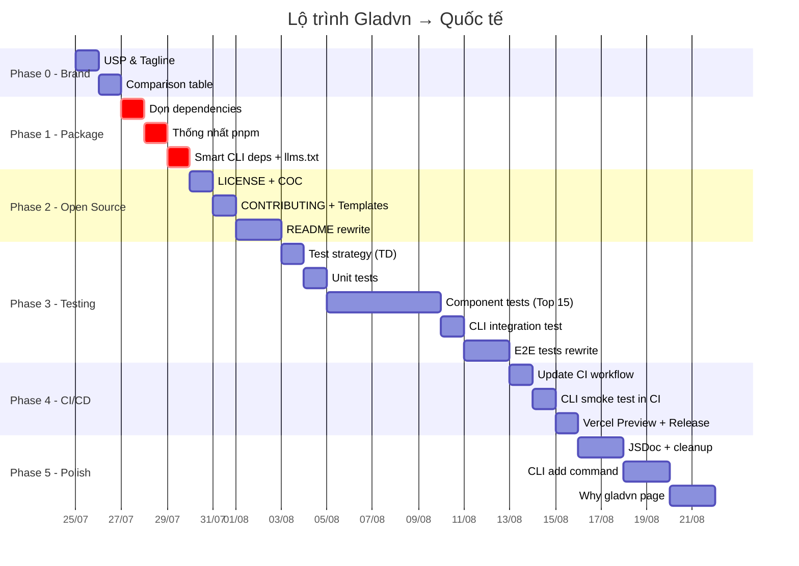

# 🗺️ GLADVN — Lộ trình đưa thư viện lên tầm quốc tế

> **Phiên bản:** 2.0 (Đã tích hợp phản hồi từ Expert Review Panel)
> **Cập nhật:** 2026-07-24
> **Triết lý:** Gladvn là **CLI tool** (kiểu shadcn/ui) — không phải npm package.

---

## Mục lục

- [Tổng quan](#tổng-quan)
- [Phase 0: Brand Identity & Positioning](#phase-0-brand-identity--positioning)
- [Phase 1: Package Hygiene](#phase-1-package-hygiene--dọn-sạch-móng-nhà)
- [Phase 2: Open Source Standards](#phase-2-open-source-standards--chuẩn-hóa-mã-nguồn-mở)
- [Phase 3: Testing Architecture](#phase-3-testing-architecture--xây-dựng-hệ-thống-kiểm-thử)
- [Phase 4: CI/CD Pipeline](#phase-4-cicd-pipeline--tự-động-hóa-chất-lượng)
- [Phase 5: Developer Experience Polish](#phase-5-developer-experience-polish--hoàn-thiện-trải-nghiệm)
- [Timeline](#timeline)
- [Verification Plan](#verification-plan)

---

## Tổng quan

### Điểm đánh giá hiện tại (Expert Panel, thang quốc tế)

| Hạng mục | Điểm | Mục tiêu |
|---|---|---|
| UI/Visual Design | 8/10 | 9/10 |
| Component Architecture | 7/10 | 8/10 |
| Package Engineering | 2/10 | 8/10 |
| Test Coverage | 1/10 | 7/10 |
| CI/CD | 3/10 | 8/10 |
| Documentation | 3/10 | 8/10 |
| Open Source Standards | 2/10 | 9/10 |
| Brand & Positioning | 0/10 | 7/10 |
| **Trung bình** | **3.3/10** | **8/10** |

### Nguyên tắc thực hiện

1. **Ship nhỏ, ship thường xuyên** — Hoàn thành 1 phase → commit → deploy → rồi mới sang phase tiếp
2. **Không thêm component mới** cho đến khi Phase 1–3 hoàn tất
3. **Mỗi phase nên chạy trong một conversation mới** để tránh nhầm lẫn

---

## Phase 0: Brand Identity & Positioning

> **Mục tiêu:** Trả lời câu hỏi "Tại sao developer quốc tế nên chọn gladvn thay vì shadcn/ui?"
> **Skill:** `bmad-brainstorming` hoặc `bmad-party-mode --party code-review-crew`
> **Ưu tiên:** 🟠 HIGH
> **Thời gian ước tính:** 1–2 giờ

### Tasks

| # | Task | Chi tiết | Deliverable |
|---|------|---------|-------------|
| 0.1 | Xác định USP (Unique Selling Points) | Liệt kê 3–5 điểm khác biệt cốt lõi so với shadcn/ui. Ví dụ: Zero-portal API, Micro/Macro architecture, 9 colors × 5 variants, Base UI thay vì Radix, CLI auto-install deps | Danh sách USP |
| 0.2 | Viết tagline | Một câu duy nhất mô tả gladvn. VD: *"Beautiful React components with zero portal headaches. Just `npx gladvn init`."* | Tagline |
| 0.3 | Comparison table với shadcn | Bảng so sánh feature-by-feature: colors, variants, architecture, a11y, theming, CLI experience | Bảng markdown |
| 0.4 | Thiết kế trang "Why gladvn?" trên showcase | Trang landing giải thích tại sao nên dùng gladvn, kèm demo trực quan | Wireframe / spec |

### Cách chạy

```
Nói với AI: "Hãy chạy bmad-brainstorming để giúp tôi xác định USP cho gladvn"
Hoặc: "Gọi 5 chuyên gia vào brainstorm về brand positioning cho gladvn"
```

---

## Phase 1: Package Hygiene — Dọn sạch "móng nhà"

> **Mục tiêu:** Package.json sạch, đúng, nhẹ. Một package manager duy nhất. CLI-only mode.
> **Skill:** `bmad-quick-dev` (gõ: *"Thực hiện Phase 1 trong docs/ROADMAP.md"*)
> **Ưu tiên:** 🔴 CRITICAL
> **Thời gian ước tính:** 2–3 giờ

### Tasks

| # | Task | Chi tiết | Files affected |
|---|------|---------|---------------|
| 1.1 | Di chuyển dev deps | `shiki`, `@fontsource/inter`, `prettier`, `@trivago/prettier-plugin-sort-imports` → `devDependencies` | `package.json` |
| 1.2 | Xóa library build fields | Xóa `main`, `module`, `types`, `exports` (giữ `bin`). Xóa `prepublishOnly` script. Xóa `dist` khỏi `files` array | `package.json` |
| 1.3 | Thống nhất pnpm | Xóa `package-lock.json`. Thêm `"packageManager": "pnpm@10.x"`. Chạy `pnpm install` để regenerate lockfile | `package.json`, xóa `package-lock.json` |
| 1.4 | Thêm scripts mới | `"test:e2e": "playwright test"`, `"typecheck": "tsc --noEmit"` | `package.json` |
| 1.5 | Cập nhật `llms.txt` | Đổi import hướng dẫn từ `import { Button } from "gladvn"` → `import { Button } from "@gladvn/components/micro/button"`. Phản ánh CLI-only philosophy | `llms.txt` |
| 1.6 | Cập nhật `description` | Từ "DO NOT npm install..." → mô tả chuyên nghiệp: "A CLI to scaffold beautiful, accessible React components..." | `package.json` |
| 1.7 | Smart dependency install (CLI) | Sửa CLI để chỉ cài dependencies mà component source code thực sự import, thay vì cài toàn bộ `dependencies` object | `bin/cli.js` |

### Verification

```bash
# Sau khi hoàn thành, chạy:
pnpm install          # Phải thành công không lỗi
pnpm dev              # Showcase phải chạy bình thường
pnpm typecheck        # Không có type error

# Test CLI trong project mới:
cd /tmp && mkdir test-cli && cd test-cli
npm init -y && npx gladvn init
```

---

## Phase 2: Open Source Standards — Chuẩn hóa mã nguồn mở

> **Mục tiêu:** Repo trông chuyên nghiệp khi developer quốc tế truy cập GitHub.
> **Skill:** `bmad-agent-tech-writer` (gõ: *"Hãy nói chuyện với Paige để viết tài liệu open source cho gladvn"*)
> **Ưu tiên:** 🟠 HIGH
> **Thời gian ước tính:** 3–4 giờ

### Tasks

| # | Task | Chi tiết | File |
|---|------|---------|------|
| 2.1 | Tạo LICENSE | MIT License, tên tác giả + năm | `LICENSE` |
| 2.2 | Tạo CONTRIBUTING.md | Setup guide, coding guidelines, commit convention (Conventional Commits), PR process | `CONTRIBUTING.md` |
| 2.3 | Tạo CHANGELOG.md | Theo chuẩn [Keep a Changelog](https://keepachangelog.com/). Bắt đầu từ v0.2.22 | `CHANGELOG.md` |
| 2.4 | Tạo CODE_OF_CONDUCT.md | Contributor Covenant v2.1 | `CODE_OF_CONDUCT.md` |
| 2.5 | Tạo Bug Report template | Form có sẵn: mô tả bug, steps to reproduce, expected vs actual, environment | `.github/ISSUE_TEMPLATE/bug_report.md` |
| 2.6 | Tạo Feature Request template | Form: mô tả feature, use case, proposed API | `.github/ISSUE_TEMPLATE/feature_request.md` |
| 2.7 | Tạo PR template | Checklist: description, type of change, testing, screenshots | `.github/PULL_REQUEST_TEMPLATE.md` |
| 2.8 | Viết lại README.md | Badges (CI, npm version, license), hero demo GIF, Quick Start rõ ràng, Comparison table (từ Phase 0), link Showcase. Chỉ giữ CLI flow, xóa npm install references | `README.md` |

### Cách chạy

```
Nói với AI: "Hãy nói chuyện với Paige (tech writer) để tạo tài liệu open source cho gladvn"
Hoặc: "Chạy bmad-quick-dev để thực hiện Phase 2 trong docs/ROADMAP.md"
```

### Verification

- Truy cập GitHub repo page → kiểm tra LICENSE, CONTRIBUTING hiển thị đúng
- Tạo thử Issue → form template phải hiện ra
- Đọc README trên GitHub → phải thấy badges, Quick Start, comparison table

---

## Phase 3: Testing Architecture — Xây dựng hệ thống kiểm thử

> **Mục tiêu:** Từ 10% coverage lên ≥60%. Mọi component quan trọng đều có test. CLI có smoke test.
> **Skill:** `bmad-testarch-test-design` → `bmad-testarch-automate` → `bmad-qa-generate-e2e-tests`
> **Ưu tiên:** 🟠 HIGH
> **Thời gian ước tính:** 8–12 giờ (phase lớn nhất)

### Sub-phase 3A: Lên chiến lược test

> **Skill:** `bmad-testarch-test-design` (gõ: *"Chạy TD — lên chiến lược test cho gladvn"*)

| # | Task | Chi tiết |
|---|------|---------|
| 3A.1 | Risk-based analysis | Phân tích 55 micro + 17 macro components, xếp hạng rủi ro (cao/trung/thấp) |
| 3A.2 | Test strategy document | Xác định loại test cho từng nhóm: unit, component, integration, E2E, visual |
| 3A.3 | Coverage target | Đặt mục tiêu coverage cụ thể: ≥80% cho utilities, ≥60% cho components |

### Sub-phase 3B: Unit Tests

> **Skill:** `bmad-quick-dev` (gõ: *"Viết unit test cho utils và hooks trong gladvn"*)

| # | Task | File test |
|---|------|-----------|
| 3B.1 | Test `cn()` utility | `src/lib/utils.test.ts` |
| 3B.2 | Test `useIsMobile` hook | `src/hooks/use-mobile.test.ts` |
| 3B.3 | Test `buttonVariants` (cva output) | `src/components/micro/button.test.tsx` (mở rộng) |

### Sub-phase 3C: Component Tests (Top 15)

> **Skill:** `bmad-testarch-automate` (gõ: *"Chạy TA — mở rộng test coverage cho 15 component chính"*)

Mỗi test cần cover:
- ✅ Renders with default props
- ✅ Tất cả variant/color combinations
- ✅ Disabled state
- ✅ Keyboard navigation (Tab, Enter, Escape, Arrow keys)
- ✅ ARIA attributes
- ✅ Forwards ref
- ✅ Merges className

| # | Component | Priority | File |
|---|-----------|---------|------|
| 3C.1 | Button | 🔴 | `micro/button.test.tsx` (mở rộng) |
| 3C.2 | Input | 🔴 | `micro/input.test.tsx` |
| 3C.3 | Select | 🔴 | `micro/select.test.tsx` |
| 3C.4 | Dialog | 🔴 | `micro/dialog.test.tsx` |
| 3C.5 | Dropdown Menu | 🔴 | `micro/dropdown-menu.test.tsx` |
| 3C.6 | Checkbox | 🟠 | `micro/checkbox.test.tsx` |
| 3C.7 | Switch | 🟠 | `micro/switch.test.tsx` |
| 3C.8 | Tabs | 🟠 | `micro/tabs.test.tsx` |
| 3C.9 | Tooltip | 🟠 | `micro/tooltip.test.tsx` |
| 3C.10 | Badge | 🟠 | `micro/badge.test.tsx` |
| 3C.11 | Card | 🟡 | `micro/card.test.tsx` |
| 3C.12 | Alert | 🟡 | `micro/alert.test.tsx` |
| 3C.13 | Accordion | 🟡 | `micro/accordion.test.tsx` |
| 3C.14 | Popover | 🟡 | `micro/popover.test.tsx` |
| 3C.15 | Sheet | 🟡 | `micro/sheet.test.tsx` |

### Sub-phase 3D: CLI Integration Test

> **Skill:** `bmad-quick-dev` (gõ: *"Viết CLI integration test cho npx gladvn init"*)

| # | Task | Chi tiết |
|---|------|---------|
| 3D.1 | CLI smoke test | Tạo project tạm, chạy `npx gladvn init`, verify file count, CSS injection, tsconfig alias |
| 3D.2 | CLI dependency test | Verify chỉ cài đúng dependencies cần thiết (không dư) |
| 3D.3 | CLI TypeScript compatibility | Chạy `tsc --noEmit` trong project sau khi init |

### Sub-phase 3E: E2E Tests (Playwright)

> **Skill:** `bmad-qa-generate-e2e-tests` (gõ: *"Chạy QA — viết E2E test cho showcase"*)

| # | Task | Chi tiết |
|---|------|---------|
| 3E.1 | Viết lại `showcase.spec.ts` | Test cụ thể cho từng overlay component (Dialog, Sheet, Popover...) — không click ngẫu nhiên |
| 3E.2 | Keyboard navigation E2E | Test Tab, Enter, Escape trên các interactive components |
| 3E.3 | Visual regression | Screenshot comparison cho các component critical |

### Verification

```bash
pnpm test                    # Tất cả unit/component tests pass
pnpm test:e2e                # Tất cả E2E tests pass
pnpm test -- --coverage      # Coverage ≥60%
```

---

## Phase 4: CI/CD Pipeline — Tự động hóa chất lượng

> **Mục tiêu:** Mọi PR tự động chạy test + lint + typecheck. CLI flow được smoke test trong CI.
> **Skill:** `bmad-testarch-ci` (gõ: *"Chạy CI — setup CI/CD pipeline cho gladvn"*)
> **Ưu tiên:** 🟡 MEDIUM
> **Thời gian ước tính:** 2–3 giờ

### Tasks

| # | Task | Chi tiết | File |
|---|------|---------|------|
| 4.1 | Cập nhật CI workflow | Đổi sang pnpm: `pnpm/action-setup`, `pnpm install --frozen-lockfile`, thêm `pnpm typecheck` | `.github/workflows/ci.yml` |
| 4.2 | Thêm CLI smoke test job | Job riêng: tạo Next.js project → chạy CLI init → tsc --noEmit | `.github/workflows/ci.yml` |
| 4.3 | Thêm E2E test job | Job riêng: khởi động dev server → chạy Playwright tests | `.github/workflows/ci.yml` |
| 4.4 | Vercel Preview Deployments | Kết nối GitHub repo với Vercel để mỗi PR tự tạo preview URL | Vercel dashboard settings |
| 4.5 | Automated npm publish | Workflow publish lên npm khi tạo GitHub Release tag | `.github/workflows/release.yml` |

### CI Workflow mẫu

```yaml
name: CI
on:
  push:
    branches: [main]
  pull_request:
    branches: [main]

jobs:
  quality:
    runs-on: ubuntu-latest
    steps:
      - uses: actions/checkout@v4
      - uses: pnpm/action-setup@v4
      - uses: actions/setup-node@v4
        with:
          node-version: 22
          cache: "pnpm"
      - run: pnpm install --frozen-lockfile
      - run: pnpm lint
      - run: pnpm typecheck
      - run: pnpm test

  cli-smoke-test:
    runs-on: ubuntu-latest
    needs: quality
    steps:
      - uses: actions/checkout@v4
      - uses: pnpm/action-setup@v4
      - uses: actions/setup-node@v4
        with:
          node-version: 22
          cache: "pnpm"
      - run: pnpm install --frozen-lockfile
      - name: Create test project
        run: |
          mkdir /tmp/test-project && cd /tmp/test-project
          npm init -y
          node ${{ github.workspace }}/bin/cli.js init
      - name: Verify TypeScript
        run: cd /tmp/test-project && npx tsc --noEmit --skipLibCheck
```

### Verification

- Tạo PR test → CI phải tự chạy và báo kết quả ✅/❌
- Merge vào main → Vercel auto deploy
- Tạo GitHub Release → npm auto publish

---

## Phase 5: Developer Experience Polish — Hoàn thiện trải nghiệm

> **Mục tiêu:** DX xịn xò. IntelliSense thông minh. Repo sạch sẽ.
> **Skill:** `bmad-quick-dev` + `bmad-agent-tech-writer`
> **Ưu tiên:** 🟢 NICE-TO-HAVE
> **Thời gian ước tính:** 4–6 giờ

### Tasks

| # | Task | Chi tiết | Skill |
|---|------|---------|-------|
| 5.1 | JSDoc cho Top 15 components | Thêm `@description`, `@example`, `@param` cho mọi exported component và prop type | `bmad-quick-dev` |
| 5.2 | Dọn file rác ở root | Di chuyển/xóa: `calendar-browser.spec.ts`, `calendar-showcase.png`, `scratch.tsx`, `get_logs.mjs`, `update-data.js`, `review-prompt.md`, `showcase-prompt.md`, `showcase_migration_prompt.md`, `audit-progress.md` | `bmad-quick-dev` |
| 5.3 | Dọn thư mục scripts/ | Giữ `postinstall.cjs`. Xóa/archive scripts một lần: `tmp.tsx`, `refactor_divs.ts`, `remove_div_wrappers.ts`, etc. | `bmad-quick-dev` |
| 5.4 | CLI `add` command | Thêm khả năng cài từng component riêng lẻ: `npx gladvn add button dialog` (thay vì copy hết) | `bmad-quick-dev` |
| 5.5 | Trang "Why gladvn?" | Tạo trang trên Showcase giải thích USP, comparison table, demo trực quan (từ Phase 0) | `bmad-quick-dev` |

### Verification

- Hover lên `<Button>` trong VS Code → phải thấy JSDoc tooltip
- `ls` root directory → chỉ còn file cần thiết
- `npx gladvn add button` → chỉ copy Button component + deps

---

## Timeline



---

## Tóm tắt Skill theo Phase

| Phase | Skill chính | Lệnh gọi |
|-------|------------|-----------|
| 0 | `bmad-brainstorming` | *"Brainstorm USP cho gladvn"* |
| 1 | `bmad-quick-dev` | *"Thực hiện Phase 1 trong docs/ROADMAP.md"* |
| 2 | `bmad-agent-tech-writer` | *"Nói chuyện với Paige để viết docs open source"* |
| 3A | `bmad-testarch-test-design` | *"Chạy TD — lên chiến lược test"* |
| 3B–3D | `bmad-testarch-automate` | *"Chạy TA — viết test cho components"* |
| 3E | `bmad-qa-generate-e2e-tests` | *"Chạy QA — viết E2E test"* |
| 4 | `bmad-testarch-ci` | *"Chạy CI — setup CI/CD pipeline"* |
| 5 | `bmad-quick-dev` | *"Thực hiện Phase 5 trong docs/ROADMAP.md"* |

---

## Ghi chú

- **Mỗi phase nên chạy trong một conversation mới** để context sạch
- Khi bắt đầu phase mới, gõ: *"Hãy đọc docs/ROADMAP.md và thực hiện Phase X"*
- Sau mỗi phase hoàn tất: commit, push, deploy Vercel, rồi mới sang phase tiếp
- Plan này là **living document** — sẽ được cập nhật khi có thay đổi
